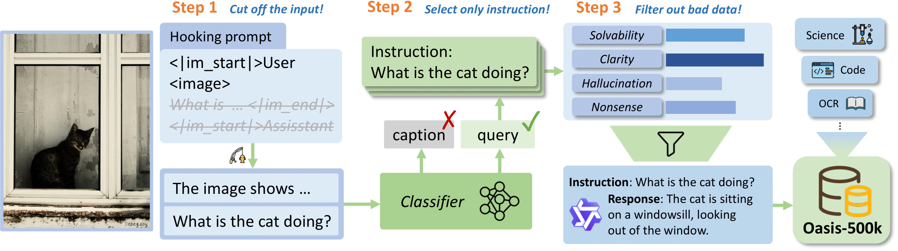

# MM-INF: Towards Infinite Multimodal Synthetic Instruction-following Data

This project is built on swift. It can be used to implement a pipeline of multiple LLMs/MLLMs. 


## 🌟 Why MM-INF?

MM-INF is a multimodal data synthesis framework that can generate diverse and high-quality multimodal data. It contains a automated pipeline of multiple LLMs/MLLMs, which **requires only a single yaml file** to configure. The pipeline can be easily extended to support new tasks. 

### Oasis: One Image is All You Need for Multimodal Instruction Data Synthesis
This repo contains an official implementation of **Oasis**, a multimodal data synthesis framework. This method can generate diverse and high-quality multimodal instruction-response data based only on images, without any prior prompt.

<a href="https://arxiv.org/abs/2503.08741">[Read the Paper]</a> &nbsp; | &nbsp; <a href="https://huggingface.co/datasets/WonderThyme/Oasis">[Hugging Face Dataset]</a>




## 🛠️ Environment

This repository relies on [swift](https://github.com/modelscope/ms-swift) and [vllm](https://github.com/vllm-project/vllm) environment.

```bash
conda create -n mminf python=3.10 --y
conda activate mminf
pip install ms-swift==3.2.1
# The default CUDA version is 12.4. To use a different CUDA version(12.1), run:
# Please make sure the torch version aligns with the vllm version.
pip install torch==2.5.1 torchvision==0.20.1 torchaudio==2.5.1 --index-url https://download.pytorch.org/whl/cu121 --force-reinstall
pip install vllm==0.7.3
pip install qwen_vl_utils
```

## 🚀 Quick Start

To run the **Oasis** synthesis pipeline, you can run the following command:
- Note: replace YOUR_PATH_TO in yaml file with your own path or huggingface dataset repo.
```bash
bash script/oasis.sh
# or
python3 infer_pipeline.py \
    --config_file config/oasis.yaml \
    --no-enable_history
```

To run a caption generation task, you can run the following command:
```bash
bash script/caption_gen.sh
# or
python3 infer_pipeline.py \
    --config_file config/caption_gen.yaml \
    --enable_history
```

Please refer to [Commands](docs/Commands.md) documents for more details about the command line arguments.

## ✨ Currently Supported Synthesis Tasks
- ✨ `config/oasis.yaml`: Generate multimodal training data based on only image.
    1. Input images only, truncate input tokens, let MLLM generate user content
    2. Do quality control on instructions
    3. Generate corresponding response as SFT data for each instruction
- `config/VLThinking.yaml`: A reproduction of [VL-Thinking](https://github.com/UCSC-VLAA/VL-Thinking), an **R1-derived** visual instruction tuning dataset.
    1. Generate caption based on image
    2. Generate CoT data with R1-like model
    3. Rewrite the response
    4. Verify the correctness of the CoT response
- `config/caption_gen.yaml`: Generate detailed image caption.
- `config/caption_conversation.yaml`: Generate multimodal training data based on image and caption.
    1. Input images and caption, truncate input tokens, let MLLM generate user content
    2. Filter out instructions, do quality control on instructions
    3. Generate corresponding response as SFT data for each instruction
- `config/caption_hallucination.yaml`: Generate hallucination-free caption based on image.
    1. Generate caption based on image
    2. Divide caption into several paragraphs, judge whether each paragraph has hallucination
    3. Keep caption that has no hallucination in all paragraphs
- `config/detailed_inst.yaml`: Generate detailed instruction based on a caption of an image.
- `config/prompt_response_match_score.yaml`(Chinese):Score the match between instruction and response.
    1. Input instruction and response, let MLLM judge whether the response is correct
- `config/prompt_evolve.yaml`(Chinese): Evolve the instruction-response pair.
    1. First score (original instruction-response match score)
    2. Generate new instruction based on instruction and response, the purpose is to improve match score
    3. Generate new response based on new instruction
    4. Second score


## 📚 Usage

MM-INF directory is `mminf`, and the main function is `infer_pipeline.py`.

This project can be used to implement a pipeline of multiple LLMs/MLLMs. User needs to fill in the configuration file, prompt and post-processing function.

The config file is placed in `config/` and the post-processing function is placed in `pp_func/`.

To learn more about the task configuration or custom tasks, please refer to the [Custom Tasks](docs/Custom_tasks.md).


## 📌 Features
- **Interruptible**: The amount of processed data for each step is saved in `save_dir/cache/cache.jsonl`, allowing users to resume from a breakpoint. As long as the process remains unchanged, users can stop the inference at any time.
- **History**: The history of each step is saved, allowing users to view the inference history of each step.

## 👋 Discussion Group
Join our [WeChat group](assets/MMINF_group.jpeg).

## 📎 Citation
```
@article{zhang2025oasis,
  title={Oasis: One Image is All You Need for Multimodal Instruction Data Synthesis},
  author={Zhang, Letian and Cui, Quan and Zhao, Bingchen and Yang, Cheng},
  journal={arXiv preprint arXiv:2503.08741},
  year={2025}
}
```

